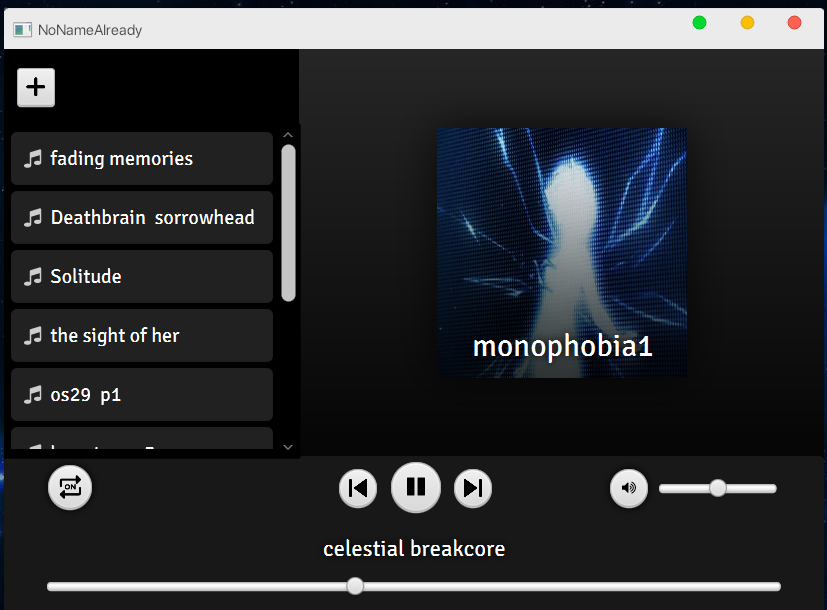

# Spirefly 🇺🇸

## Description:

Spirefly is an open source audio player made in Java using JavaFX

## Tools and Languages:
- IntellijIdea
- Javafx
- FXML
- CSS

## Future Updates:
- [x] Use player with keyboard keys
- [x] Show music Cover art
- [x] Save songs to any local file/database
- [ ] PLaylist System
- [ ] Change music speed
- [ ] Shuffle Playback
- [ ] Support for other operating systems (Linux or MAC)
- [ ] Create an executable `.jar` or `.exe`
- [ ] Theme change option (Light)

## Features

- Compatible with `.mp3` and other audio formats
- Autoplay
- Simple and minimalist interface
  
## What's New?
**02/03/2024 updates**

- Player control system using the keyboard - Now you can use the player by pressing the Keys: `UP` to play next Song, `DOWN` to play previous Song, `SPACE` to Pause/Pay  and `M` to mute/unmute
- You can see the music cover image (the image must be present in the audio metadata)
- you can also change the image that is shown in the player while the song is playing (Beta version)

**02/04/2024 updates**
- The musics are stored in a local database, a `.db` file (SQLite)
- Music loop option
- Add musics option 

---

# Spirefly 🇧🇷

## Descrição:

Spirefly é um reprodutor de audio de código aberto feito em java usando javafx 

## Ferramentas e Linguagens:
- IntellijIdea
- Javafx
- FXML
- CSS

## Futuras Atualizações:
- [x] Manipular o player com o teclado
- [x] Mostrar arte (capa) da faixa
- [x] Salvar musicas em um arquivo/banco de dados
- [ ] Sistema de playlists
- [ ] Alterar velocidade de música
- [ ] Reprodução aleatória
- [ ] Suporte a outros sistemas operacionais (Linux ou MAC)
- [ ] Lançar executável `.jar` ou `.exe`
- [ ] Mudança de tema (Claro)

## Como funciona?

A aplicação cria uma pasta localizada em `C:/ProgramFiles/Spirefly` e as faixas são exibidas ao iniciar

## Recursos

- Compatível com `.mp3` e outros formatos de audio
- Reprodução automática
- Interface Simples e minimalista

## O que há de novo?
**Atualizações de 03/02/2024**

- Sistema de controle via teclado - Agora você pode controlar o player por meio das teclas: `CIMA` para tocar a proxima faixa, `BAIXO` para voltar para a faixa anterior, `ESPAÇO` para Tocar/Pausar e `M` para Mutar/Desmutar
- Você pode visualizar a imagem de capa da música enquanto ela é tocada (a mesma deve estar presente nos metadados do audio para isso)
- Também é possível mudar a imagem de exibição durante a reprodução da música, podendo escolher uma imagem de sua preferência (Versão Beta)

**Atualizações de 04/02/2024**

- Agora as músicas salvas ficam armazenadas em um banco de dados local `.db` baseado em SQL
- Opção de ativar loop de música
- Opção para adicionar novas músicas, sem a necessidade da pasta

## Screenshots:

