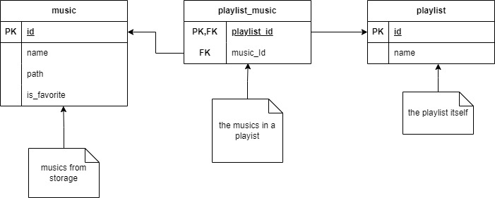

## Database System prototype

### Music
store user-added songs and has the attributes

- id (INT): to uniquely identify the tuple
- name (TEXT): the name of the song
- path (TEXT): the path to the song file
- if_favorite (BIT) stores 0 or 1 values to add a song to favorites

### playlist
store a playlist item created by user and has the attributes

- id (INT): to uniquely identify the tuple
- name (TEXT): the name of the created playlist

### playlist_music
store the songs, separating them into playlists

- playlist_id (INT): points to a playlist id tuple to represent that it makes part of the playlist indicated by the id
- music_id (TEXT): points to a music id to represent the music